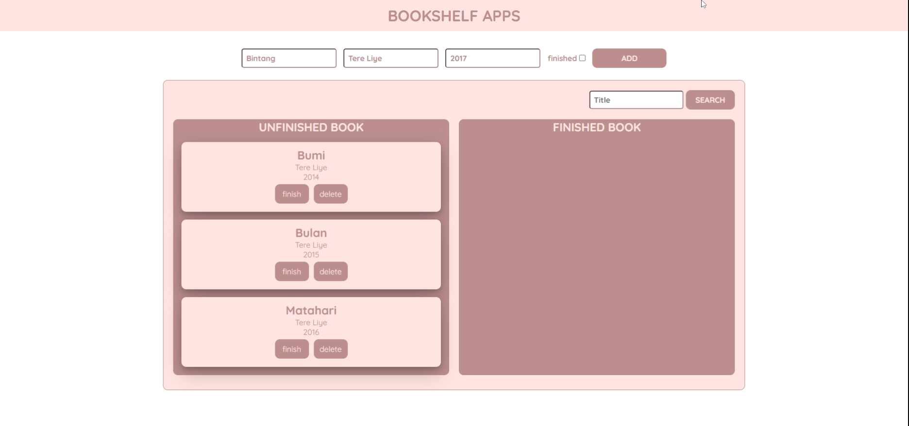
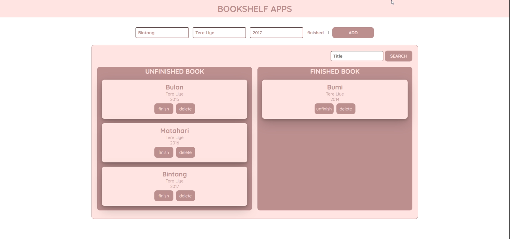

<h1 align="center">
Bookshelf App
</h1>

adalah aplikasi web yang dapat memasukan data buku ke dalam rak, memindahkan data buku antar rak, dan menghapus data buku dari rak.

<h2 align="center">
Preview Web
</h2>

  
  <!-- &#8287;&#8287;&#8287;&#8287;&#8287; -->
  

  <!--  -->
  <!-- &#8287;&#8287;&#8287;&#8287;&#8287; -->
  <!--  -->

<h2 align="center">
Presented By
</h2>
<h3 align="center">Rafi Rachmad Ramadhan</h3>
 
